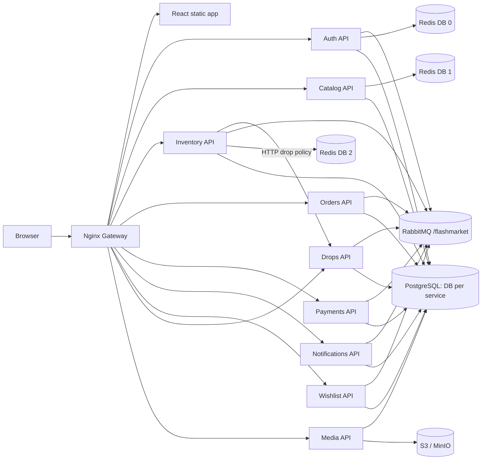
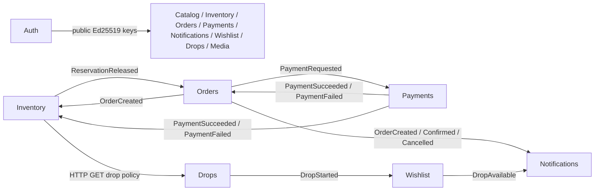

# FlashMarket Architecture Audit

> Дата аудита: 2026-08-14; runtime update: 2026-08-17. Объект: текущее состояние репозитория `flashmarket`.
> Это описание фактически найденной архитектуры, обновлённое после внедрения Celery maintenance layer.

## Как читать статусы и доказательства

- `IMPLEMENTED` — поведение подтверждено исполняемым кодом, конфигурацией/миграцией и, где возможно, тестом.
- `PARTIALLY_IMPLEMENTED` — существенная часть есть, но полный заявленный бизнес- или operational-контур не замкнут.
- `PLANNED` — решение есть только в планах/spec/ideas и не найдено в runtime-коде.
- `UNCLEAR` — репозиторий не позволяет сделать однозначный вывод.

Пути в колонке **Evidence** даны относительно корня репозитория. Старые `project.md`, `specs.md`, `catalog.md`, `ideas.md` и документы в `docs/superpowers` использовались как контекст, но при расхождении источником истины считались runtime-код, миграции, Compose и тесты.

---

## 1. Executive Summary

FlashMarket — модульная event-driven e-commerce система из девяти FastAPI-сервисов, React/Vite storefront/admin UI и Nginx gateway. Каждый backend-сервис владеет отдельной логической PostgreSQL database в общем внешнем PostgreSQL instance; Auth, Catalog и Inventory дополнительно используют разные Redis DB, Media — S3-compatible object storage. Межсервисная purchase saga построена как choreography через RabbitMQ topic exchange `flashmarket.events`. Периодические Auth, Inventory, Drops и Media jobs выполняются четырьмя service-owned Celery workers под одним Beat; integration-event consumers и outbox relays остаются на `aio-pika`. **Статус: `IMPLEMENTED`.** Evidence: `docker-compose.yml`; `docker/entrypoint.sh`; `shared/celery_runtime/`; service `tasks.py`.

Сильнейшая часть backend-дизайна — delivery boundary: business mutation и outbox row коммитятся вместе; relay берёт короткую lease через `FOR UPDATE SKIP LOCKED`, публикует persistent message с publisher confirms, mandatory routing для событий с известным consumer и сохраняет randomized exponential backoff. Consumers используют retry queues 5/30/120 секунд, DLQ и transactional inbox. Гарантия — **at-least-once**, не exactly-once; стабильный event/message ID и inbox закрывают ожидаемые дубликаты. **Статус: `IMPLEMENTED`.** Evidence: `shared/rabbitmq_reliability/rabbitmq_reliability/outbox_lease.py` (`claim_next_event`, `record_publish_result`); `delivery.py` (`publish_confirmed`, `process_with_retries`); `inbox.py`; `topology.py`; service `outbox_worker.py`/`event_consumer.py`.

Inventory хорошо защищает основной инвариант stock: PostgreSQL row lock на stock, CHECK constraints, одна транзакция для stock/reservation/outbox, `SKIP LOCKED` у expiry worker и PostgreSQL advisory transaction lock для лимита пользователя в drop. Redis stock cache fail-open и revision-aware, поэтому database остаётся source of truth. **Статус: `IMPLEMENTED`.** Evidence: `inventory/src/inventory/application/services/stock.py`; `infrastructure/repositories/stock.py`; `infrastructure/models.py`; `infrastructure/stock_cache.py`.

При этом current payment flow остаётся mock: клиент создаёт и сам подтверждает payment, Orders принимает цену и товарный snapshot из запроса, а реальные PSP callback/signature/refund/compensation отсутствуют. В pet/demo-контуре это работоспособно, но не является production-grade payment integrity boundary. **Статус: `PARTIALLY_IMPLEMENTED`.** Evidence: `frontend/src/components/Order/OrderDetailView.jsx`; `orders/src/orders/application/services/order.py`; `payments/src/payments/api/routes/payments.py`; `payments/src/payments/application/services/payment.py`; `ideas.md` (real payment integration).

Наиболее значимые ограничения: нет database uniqueness для `orders.reservation_id` и `payments.order_id`; nullable `stocks.variant_id` ослабляет composite unique для default SKU в PostgreSQL; terminal state handlers не везде lock-ят саму aggregate row; HTTP idempotency keys отсутствуют; auth session revocation в downstream API задерживается до истечения access JWT (по умолчанию 5 минут); correlation ID не проходит сквозь HTTP → RabbitMQ; нет OpenTelemetry tracing; SMTP configuration есть, но реального delivery worker нет; опубликованные outbox rows чистятся только в Auth. Evidence приведены в разделах 13–21.

### Проверка, выполненная во время аудита

- Все девять service-level Python suites, shared JWT verifier, shared RabbitMQ reliability и gateway suite завершились успешно; live-infrastructure cases были помечены тестами как skipped там, где нет PostgreSQL/S3/RabbitMQ.
- Frontend: 14/14 Node tests прошли.
- `pip-audit` по virtual environment каждого из девяти сервисов: известных уязвимостей PyPI-зависимостей не найдено; локальные packages (`flashmarket-*`, `jwt-verifier`, `rabbitmq-reliability`) ожидаемо не сопоставляются с PyPI.
- `npm audit` нашёл 3 dependency findings: vulnerable Vite 5.4.21, esbuild 0.21.5 и nanoid 3.3.16; они находятся в frontend dev/build toolchain, но Vite dev server действительно запускается с network host в dev Compose.
- Поиск tracked private keys и high-confidence secret patterns не нашёл приватных ключей/токенов. Корневой `.env` существует, но игнорируется Git; его значения не читались в отчёт и не выводились.

Evidence: `scripts/test_runner.py`; service `tests/`; `shared/*/tests/`; `frontend/package-lock.json`; `frontend/package.json`; `.gitignore`.

---

## 2. System Components

| Component | Role / owned state | Runtime | Status | Evidence |
|---|---|---|---|---|
| Gateway | Public path routing, per-IP local rate limits, request/body/time limits, media proxy | Nginx | `IMPLEMENTED` | `gateway/nginx.conf`; `gateway/docker-compose.yml` |
| Frontend | Storefront, account, checkout, wishlist, drop and admin UI; browser cart/access-token state | React 18, Vite 5; production static Nginx | `IMPLEMENTED` | `frontend/src/App.jsx`; `frontend/src/components/`; `frontend/Dockerfile` |
| Auth | Identity, credentials, sessions, refresh rotation, audit and identity events | FastAPI + PostgreSQL + Redis + RabbitMQ outbox | `IMPLEMENTED` | `auth/src/auth_service/`; `auth/migrations/` |
| Catalog | Products, categories, brands, variants, search, category-tree cache | FastAPI + PostgreSQL + Redis | `IMPLEMENTED` | `catalog/src/catalog/`; `catalog/migrations/` |
| Inventory | Stock, reservations, drop purchase policy, expiration, inventory events | FastAPI + PostgreSQL + Redis + RabbitMQ | `IMPLEMENTED` | `inventory/src/inventory/`; `inventory/migrations/` |
| Orders | Orders, checkout snapshots, promocodes, order state and events | FastAPI + PostgreSQL + RabbitMQ | `IMPLEMENTED` | `orders/src/orders/`; `orders/migrations/` |
| Payments | Mock payments and payment state events | FastAPI + PostgreSQL + RabbitMQ | `PARTIALLY_IMPLEMENTED` | `payments/src/payments/`; `ideas.md` |
| Notifications | Notification records, read/delivery state and events | FastAPI + PostgreSQL + RabbitMQ | `PARTIALLY_IMPLEMENTED` | `notifications/src/notifications/`; `notifications/src/notifications/config.py` (`smtp_*`) |
| Wishlist | User wishlist and per-user DropAvailable fan-out | FastAPI + PostgreSQL + RabbitMQ | `IMPLEMENTED` | `wishlist/src/wishlist/`; `wishlist/migrations/` |
| Drops | Flash-sale definitions, items, lifecycle scheduler and events | FastAPI + PostgreSQL + RabbitMQ | `IMPLEMENTED` | `drops/src/drops/`; `drops/migrations/` |
| Media | Upload metadata, presigned S3 POST, validation, binding and cleanup | FastAPI + PostgreSQL + S3/MinIO | `IMPLEMENTED` | `media/src/media_service/`; `media/migrations/` |
| PostgreSQL | Nine logical service databases in one external cluster | External `shide-postgres` | `IMPLEMENTED` | `.env.example`; `docker/init-infra.py`; service Compose settings |
| Redis | Auth DB 0, Catalog DB 1, Inventory DB 2 | External `shide-redis` | `IMPLEMENTED` | `docker-compose.yml`; service config/cache modules |
| RabbitMQ | `/flashmarket` for integration events; isolated `/flashmarket-tasks` for Celery commands | External `shide-rabbitmq` | `IMPLEMENTED` | `docker/init-infra.py`; `shared/rabbitmq_reliability/`; `shared/celery_runtime/` |
| Object storage | Public media bucket and object bytes; Media owns only metadata | External `shide-minio` | `IMPLEMENTED` | `Makefile`; `media/src/media_service/infrastructure/s3_storage.py` |
| Prometheus/exporters | API/worker/gateway/Rabbit metrics and reliability alerts | External observability stack + repo configs | `PARTIALLY_IMPLEMENTED` | `deploy/prometheus/`; `docs/runbooks/rabbitmq-reliability.md` |
| Celery | Singleton Beat, four service-owned queues/workers, late ACK and persistent per-child asyncio runtime | Celery 5.6 + RabbitMQ `/flashmarket-tasks` | `IMPLEMENTED` | `shared/celery_runtime/`; Auth/Inventory/Drops/Media `tasks.py`; Compose |

### Runtime topology



Root `docker-compose.yml` материализует отдельные process roles: `auth-keygen`, API, consumer, outbox, auth cleanup, inventory expiry, drops scheduler и media cleanup. `docker-compose.prod.yml` расширяет только gateway/frontend; backend production deployment живёт также в per-service Compose/workflows, поэтому один prod-файл не является полным manifest всей системы. **Статус: `PARTIALLY_IMPLEMENTED` как единый production manifest.** Evidence: `docker-compose.yml`; `docker-compose.prod.yml`; `*/docker-compose.yml`; `.github/workflows/*-deploy.yml`.

---

## 3. Microservices

### 3.1 Auth

**Bounded context и ownership.** Users, password hashes, roles/status, sessions, one-time refresh-token chain, security audit events и identity integration outbox. Только Auth имеет private Ed25519 key и выпускает JWT. **Статус: `IMPLEMENTED`.**

**Значимые API:** `POST /api/v1/auth/register`, `POST /api/v1/auth/login`, `POST /api/v1/auth/refresh`, `POST /api/v1/auth/logout`, `POST /api/v1/auth/introspect`; `GET/PATCH /api/v1/users/me`; password/session operations; admin user/role/status operations; audit query; JWKS, health/readiness/metrics. Routers также монтируются в compatibility prefixes без `/api/v1`. Evidence: `auth/src/auth_service/main.py`; `api/auth.py`; `api/users.py`; `api/sessions.py`; `api/admin.py`; `api/audit.py`.

**Слои.** API dependencies/routes → application use cases/contracts/UoW → domain events/errors → SQLAlchemy repositories, Redis session/rate-limit adapters, crypto/key management, outbox worker. Business UoW and outbox are committed together. Evidence: `auth/src/auth_service/application/`; `domain/`; `infrastructure/persistence/`; `unit_of_work.py`.

**Storage.** PostgreSQL `users`, `sessions`, `refresh_tokens`, `audit_events`, `outbox_events`; Redis session/rate-limit/touch keys; split private/public key volumes. Evidence: `auth/src/auth_service/models.py`; `auth/migrations/`; `auth/docker-compose.yml`.

**Dependencies.** PostgreSQL; Redis (session presence and throttling); RabbitMQ producer only. Downstream services consume Auth public keys, not an Auth HTTP call. Identity events have no repository consumers and are intentionally non-mandatory. Evidence: `auth/src/auth_service/outbox_worker.py`; `docs/superpowers/specs/2026-07-31-local-jwt-authorization-design.md`.

### 3.2 Catalog

**Bounded context и ownership.** Categories, brands, products, product images, SKU variants and searchable public product projection. **Статус: `IMPLEMENTED`.**

**Значимые API:** public `GET /api/v1/products`, `GET /api/v1/products/{slug-or-id}`, `POST /api/v1/products/batch`, category tree, brands and variants; admin create/update/archive product/category/brand/variant operations. Evidence: `catalog/src/catalog/api/routes/`.

**Слои.** FastAPI routes → application services/schemas → domain enum/errors → SQLAlchemy repositories/search and Redis category cache. Messaging/worker layer отсутствует. Evidence: `catalog/src/catalog/application/`; `domain/`; `infrastructure/`.

**Storage.** `categories`, `brands`, `products`, `product_images`, `product_variants`; Redis key `catalog:categories:tree:v1`. Weighted Russian FTS and trigram GIN indexes support search. Evidence: `catalog/src/catalog/infrastructure/models.py`; `infrastructure/search.py`; `infrastructure/category_cache.py`; migrations `0001`–`0004`.

**Dependencies.** PostgreSQL, Redis and locally verified Auth JWT. Нет HTTP/event dependency на другие business services. Public batch returns only `ACTIVE` products. Evidence: `ProductService.get_public_batch`; `ProductRepository.get_public_by_ids`.

### 3.3 Inventory

**Bounded context и ownership.** Stock counters and reservations, including expiration and drop association. Catalog product/variant IDs are external references without cross-database FK. **Статус: `IMPLEMENTED`.**

**Значимые API:** public stock read; admin stock create/reset and HTTP commit; authenticated owner/admin reserve/release. Evidence: `inventory/src/inventory/api/routes/stock.py`.

**Слои.** Routes → `StockService` → repository/cache/drop-policy ports; SQLAlchemy persistence; Rabbit consumer/outbox processes and Celery expiry task. Evidence: `inventory/src/inventory/application/services/stock.py`; `application/contracts.py`; `event_consumer.py`; `outbox_worker.py`; `tasks.py`.

**Storage.** `stocks`, `reservations`, `outbox_events`, `processed_events`; Redis hash per product/variant. Evidence: `inventory/src/inventory/infrastructure/models.py`; migrations.

**Dependencies.** Synchronous HTTP to Drops only when `drop_id` is supplied; asynchronous input from Orders/Payments; output inventory events to Orders. Redis is cache, PostgreSQL is authority. Evidence: `inventory/src/inventory/infrastructure/drop_client.py`; `event_consumer.py`; `outbox_worker.py`.

### 3.4 Orders

**Bounded context и ownership.** Order lifecycle, immutable product/variant/price snapshots, checkout grouping, delivery snapshot fields, promocodes and their usage. **Статус: `IMPLEMENTED`, payment integrity only `PARTIALLY_IMPLEMENTED`.**

**Значимые API:** authenticated `POST /api/v1/orders`, batch checkout creation, get/list own orders, current mock confirm/fail; admin promocode CRUD; authenticated validation. Evidence: `orders/src/orders/api/routes/orders.py`; `promocodes.py`.

**Слои/storage.** Routes → `OrderService`/`PromocodeService` → repositories → `orders`, `promocodes`, `promocode_usages`, `outbox_events`, `processed_events`; consumer and outbox relay. Evidence: `orders/src/orders/application/services/`; `infrastructure/models.py`; migrations.

**Dependencies.** Emits order/payment-request events; consumes payment result and reservation release. It does not synchronously validate Catalog/Inventory and trusts request snapshots. Evidence: `orders/src/orders/application/services/order.py`; `orders/src/orders/event_consumer.py`.

### 3.5 Payments

**Bounded context и ownership.** Payment attempts and their mock state transitions. **Статус: `PARTIALLY_IMPLEMENTED`; real provider absent.**

**Значимые API:** authenticated create/get/list own payment and mock `POST .../{id}/confirm|fail|cancel`. Evidence: `payments/src/payments/api/routes/payments.py`.

**Слои/storage.** Routes → `PaymentService` → repository → `payments`, `outbox_events`, `processed_events`; PaymentRequested consumer and outbox relay. Evidence: `payments/src/payments/`.

**Dependencies.** Consumes `orders.PaymentRequested`; emits success/failure/cancel events. No PSP SDK, webhook signature verifier, capture/refund or HTTP provider client was found. Evidence: `payments/src/payments/event_consumer.py`; `application/services/payment.py`; `pyproject.toml`.

### 3.6 Notifications

**Bounded context и ownership.** Per-user notification record, read state, send state, attachment URL and delivery attempts. **Статус: `PARTIALLY_IMPLEMENTED`: state machine exists, physical delivery does not.**

**Значимые API:** admin create/fail; owner/admin list/get/read and current `send` transition. Evidence: `notifications/src/notifications/api/routes/notifications.py`.

**Storage/dependencies.** `notifications`, `outbox_events`, `processed_events`; consumes order and wishlist events; emits terminal `NotificationSent`. `smtp_*` settings exist, but no SMTP client/delivery worker is referenced outside configuration. Evidence: `notifications/src/notifications/config.py`; `event_consumer.py`; `outbox_worker.py`; repository-wide `smtp` search.

### 3.7 Wishlist

**Bounded context и ownership.** User/product wishlist membership and durable per-user drop notification fan-out. **Статус: `IMPLEMENTED`.**

**Значимые API:** authenticated owner/admin add/remove/list/check wishlist item. Evidence: `wishlist/src/wishlist/api/routes/wishlist.py`.

**Storage/dependencies.** `wishlist_items` unique `(user_id, product_id)`, `outbox_events` unique `event_key`, `processed_events`; consumes `drops.DropStarted`, queries matching wishlist users, writes one `wishlist.DropAvailable` outbox row per user in the inbox transaction; Notifications consumes it. Evidence: `wishlist/src/wishlist/event_consumer.py`; `infrastructure/models.py`; migrations `0001`–`0003`.

### 3.8 Drops

**Bounded context и ownership.** Flash-sale definition, product membership, schedule, per-user purchase limit and payment timeout. **Статус: `IMPLEMENTED`.**

**Значимые API:** public active/upcoming/detail by slug/id; admin CRUD, item management and lifecycle transitions. The by-id route is also the synchronous Inventory policy boundary. Evidence: `drops/src/drops/api/routes/drops.py`; `admin.py`.

**Storage/dependencies.** `drops`, `drop_items`, `outbox_events`; scheduler automatically opens/closes due drops; outbox emits four lifecycle events. Wishlist consumes only `DropStarted`. Evidence: `drops/src/drops/scheduler.py`; `application/services/drop.py`; `outbox_worker.py`; migrations.

### 3.9 Media

**Bounded context и ownership.** Upload metadata, ownership, purpose/entity binding, lifecycle, checksum and validation results. S3 owns bytes; Media owns authoritative metadata. **Статус: `IMPLEMENTED`.**

**Значимые API:** create presigned upload, complete/validate, bind, request deletion, get/list own/admin/entity assets. Evidence: `media/src/media_service/api/routes/media.py`.

**Storage/dependencies.** PostgreSQL `media_assets`; S3/MinIO presigned POST, HEAD/GET/DELETE; Celery cleanup task. Purpose policy determines owner/admin access and public binding. Evidence: `media/src/media_service/application/services/assets.py`; `domain/policies.py`; `infrastructure/s3_storage.py`; `tasks.py`; initial migration.

---

## 4. Service Dependency Graph



| Caller / producer → receiver | Transport and contract | Consistency / purpose | Failure behaviour | Evidence |
|---|---|---|---|---|
| Browser → Gateway → APIs | HTTPS/REST JSON + Bearer JWT; refresh uses cookie/CSRF | Synchronous; public and user workflows | Nginx returns upstream error/timeout; frontend performs one refresh-and-retry on 401 | `gateway/nginx.conf`; `frontend/src/services/api.js` |
| Inventory → Drops | HTTP `GET /api/v1/drops/id/{drop_id}` | Synchronous authorization of drop reservation | 1 s timeout/non-2xx fails closed as DropServiceUnavailable/Denied; no retry/circuit breaker | `inventory/src/inventory/infrastructure/drop_client.py`; `StockService.reserve` |
| Auth → downstream APIs | Read-only filesystem distribution of public PEM keys | Deployment-time/local synchronous verification; avoids per-request Auth hop | Missing/malformed/unknown key fails startup or JWT validation; key directory reload on unknown `kid` | `shared/jwt_verifier/jwt_verifier/verifier.py`; Compose volumes |
| Outbox producers → RabbitMQ | Persistent JSON, `message_id=event id`, header `event_id`, topic routing key | Async eventual consistency | confirms/mandatory/timeout; failed rows are scheduled with jittered backoff | service `outbox_worker.py`; shared `delivery.py`/`outbox_lease.py` |
| RabbitMQ → consumers | Durable main queue + three TTL retry queues + DLQ | Async side effects | transient 5/30/120 s retries then DLQ; permanent payload error directly DLQ | shared `delivery.py` (`process_with_retries`); `topology.py` |
| Services → own PostgreSQL DB | SQLAlchemy async transactions | Strong consistency inside a service boundary | rollback on exception; no distributed DB transaction | service UoW/repositories; migrations |
| Auth/Catalog/Inventory → Redis | sessions/rate limits; category cache; stock cache | Synchronous auxiliary state | Auth auth/rate paths fail closed; Catalog/Inventory cache paths fail open to DB | respective Redis adapters |
| Media → S3/MinIO | Presigned POST and SDK HEAD/stream/delete | Synchronous object lifecycle with DB metadata | complete/cleanup retains retryable DB state on storage failure | Media storage/service/cleanup code |

Прямого межсервисного чтения чужой database, shared ORM model или foreign key между service databases не найдено. Общий PostgreSQL **instance** не означает shared data ownership. **Статус: `IMPLEMENTED`.** Evidence: connection URLs in `docker-compose.yml`; `docker/init-infra.py`.

---

## 5. API communication

### Public routing boundary

Gateway routes versioned Auth, Catalog, Inventory, Orders/Promocodes, Payments, Notifications, Wishlist, Drops and Media paths to owning APIs. It applies four local-memory per-IP rate profiles (auth 5 r/s, transaction 10 r/s, catalog 50 r/s, general 20 r/s), body limits (16 KiB general; 30 MiB storage path), timeouts, JSON 429 and trusted proxy networks. Health/metrics locations bypass normal rate limiting. **Статус: `IMPLEMENTED`.** Evidence: `gateway/nginx.conf`; `tests/test_gateway_routing.py`.

Rate counters are per Nginx instance, not globally coordinated; horizontally scaled gateways do not share limits. **Статус: `PARTIALLY_IMPLEMENTED` for distributed rate limiting.** Evidence: `limit_req_zone ... zone=` in `gateway/nginx.conf`; `docs/superpowers/specs/2026-08-01-gateway-rate-limiting-design.md` (`Operational Constraint`).

### Only business service-to-service HTTP call

`Inventory.StockService.reserve` calls Drops only for a drop reservation. Request: drop UUID plus product/user context; response is mapped to an `ACTIVE` drop policy with membership, `max_per_user` and `payment_timeout_seconds`. The call happens before the local stock transaction; on timeout or dependency error the reservation is rejected rather than bypassing policy. This is synchronous consistency for policy discovery, followed by PostgreSQL enforcement of the returned policy. Evidence: `inventory/src/inventory/infrastructure/drop_client.py`; `application/contracts.py`; `application/services/stock.py`.

### Authentication across APIs

Downstream services validate access JWT locally through `shared/jwt_verifier`; they do not call Auth/Redis per request. Ownership is checked against `principal.user_id`, admin paths require role `ADMIN`. Logout/block/password change therefore invalidates Auth's Redis session immediately only for Auth endpoints; already issued downstream access tokens remain acceptable until expiry. **Статус: `IMPLEMENTED` with deliberate eventual revocation.** Evidence: `docs/superpowers/specs/2026-07-31-local-jwt-authorization-design.md`; shared verifier; each service `api/auth.py`/dependencies.

---

## 6. Event-driven communication

The shared durable topic exchange is `flashmarket.events` in RabbitMQ vhost `/flashmarket`. Producers are outbox relays, not request handlers publishing directly. Consumers declare their durable main queue and bindings:

| Queue | Routing keys consumed | Handler owner |
|---|---|---|
| `inventory.events` | `orders.OrderCreated`, `payments.PaymentSucceeded`, `payments.PaymentFailed`, `orders.OrderCancelled` | Inventory |
| `orders.events` | `payments.PaymentSucceeded`, `payments.PaymentFailed`, `inventory.ReservationReleased` | Orders |
| `payments.events` | `orders.PaymentRequested` | Payments |
| `notifications.events` | `orders.OrderCreated`, `orders.OrderConfirmed`, `orders.OrderCancelled`, `wishlist.DropAvailable` | Notifications |
| `wishlist.drop-events` | `drops.DropStarted` | Wishlist |

Evidence: service `event_consumer.py`; service settings; `shared/rabbitmq_reliability/rabbitmq_reliability/topology.py`.

Event envelopes are not uniform. Auth publishes an envelope with `schema_version`, event id/time, aggregate and `data`; other services serialize flat payload dictionaries without a schema version. Consumers perform manual required-field/UUID validation; malformed JSON or converted validation errors become `PermanentMessageError` and go directly to DLQ. **Статус: `PARTIALLY_IMPLEMENTED` event contract governance.** Evidence: `auth/src/auth_service/domain/events.py`; `auth/src/auth_service/outbox_worker.py`; other service outbox/consumer modules.

`message_id` and `event_id` are stable per outbox row. AMQP `correlation_id` is preserved during retries, but request middleware does not inject the HTTP `request_id` into new events, so business flow correlation is manual via order/reservation/payment/event IDs. Evidence: shared `delivery.py`; service `event_consumer.py`; service observability middleware and outbox builders.

---

## 7. Event Catalog

Обозначение retry в таблице: **O** — outbox retry с jittered exponential backoff до 300 s; **C** — consumer retry queues 5/30/120 s и затем DLQ; **—** — в репозитории нет consumer. Все transport rows используют `flashmarket.events`; identity events route по `identity.*`, остальные — по `<producer>.<EventName>`.

| Event / routing key | Producer / trigger | Payload (существенные поля) | Queue → consumer / side effect | Retry | Idempotency | Status / evidence |
|---|---|---|---|---|---|---|
| `identity.user_registered` | Auth, successful registration | Auth envelope; user identity data | — | O | stable outbox/event ID | `IMPLEMENTED`; `auth/.../domain/events.py`; application auth use case |
| `identity.user_logged_in` | Auth, successful login | Auth envelope; user/session context | — | O | stable ID | `IMPLEMENTED`; same |
| `identity.token_refreshed` | Auth, successful refresh rotation | Auth envelope; user/session context | — | O | locked one-time refresh chain | `IMPLEMENTED`; `AuthService.refresh` |
| `identity.refresh_token_reuse` | Auth, consumed/revoked refresh reused | Auth envelope; user/session context | — | O | replay revokes session under lock | `IMPLEMENTED`; `AuthService.refresh` |
| `identity.user_logged_out` | Auth logout | Auth envelope | — | O | session revocation is repeat-safe | `IMPLEMENTED` |
| `identity.profile_updated` | User profile mutation | Auth envelope | — | O | event ID | `IMPLEMENTED` |
| `identity.password_changed` | Password change | Auth envelope | — | O | sessions revoked by use case | `IMPLEMENTED` |
| `identity.user_role_changed` | Admin role mutation | Auth envelope | — | O | event ID | `IMPLEMENTED` |
| `identity.user_status_changed` | Admin active/status mutation | Auth envelope | — | O | event ID | `IMPLEMENTED` |
| `identity.session_revoked` | Single session revocation | Auth envelope | — | O | persisted session state | `IMPLEMENTED` |
| `identity.all_sessions_revoked` | Revoke all user sessions | Auth envelope | — | O | persisted session state | `IMPLEMENTED` |
| `inventory.InventoryReserved` | Successful reserve transaction | `reservation_id,user_id,product_id,variant_id,quantity,order_id,expires_at,drop_id` | — | O | stable event ID | `IMPLEMENTED`, terminal/no subscriber; Inventory service/outbox |
| `inventory.InventoryCommitted` | Payment success commits reservation | `reservation_id,product_id,order_id,quantity` | — | O | consumer inbox on source payment; reservation status | `IMPLEMENTED`, terminal/no subscriber |
| `inventory.ReservationReleased` | failure/cancel/expiry/manual release | `reservation_id,product_id,order_id,quantity,reason` | `orders.events` → cancel awaiting/pending order | O+C | Orders `processed_events`; state guard | `IMPLEMENTED`; Inventory service; Orders consumer |
| `orders.OrderCreated` | Order create/batch transaction | `order_id,checkout_id,reservation_id,user_id,product_id,product_name,amount,currency,payment_expires_at` | `inventory.events` → bind order; `notifications.events` → create notification | O+C per queue | independent inbox in each consumer | `IMPLEMENTED`; Orders service/outbox |
| `orders.PaymentRequested` | Same order creation | same payment-relevant snapshot | `payments.events` → create mock PENDING payment | O+C | Payments inbox + existing-by-order application check | `IMPLEMENTED`; Orders/Payments |
| `orders.OrderConfirmed` | Payment success or mock HTTP confirm | `order_id,reservation_id,payment_id,user_id` | `notifications.events` → confirmation notification | O+C | Notifications inbox | `IMPLEMENTED` |
| `orders.OrderCancelled` | Payment failure, release or mock fail | `order_id,reservation_id,payment_id,user_id,reason` | `inventory.events` → release; `notifications.events` → cancellation notification | O+C | both consumer inboxes; Inventory status guard | `IMPLEMENTED` |
| `payments.PaymentSucceeded` | Mock confirm | `payment_id,order_id,user_id,amount,currency` | `orders.events` → confirm order; `inventory.events` → commit stock | O+C | consumer inboxes + state guards | `IMPLEMENTED`; strict mandatory route |
| `payments.PaymentFailed` | Mock fail | previous fields + `reason` | `orders.events` → cancel; `inventory.events` → release | O+C | consumer inboxes + state guards | `IMPLEMENTED`; strict mandatory route |
| `payments.PaymentCancelled` | Owner/admin cancellation | payment/order/user data | — | O | persisted payment status | `IMPLEMENTED`, no repository subscriber; non-mandatory |
| `drops.DropScheduled` | Admin schedules drop | drop lifecycle data | — | O | stable event ID | `IMPLEMENTED`, no subscriber |
| `drops.DropStarted` | Admin or scheduler opens drop | `drop_id` and product/drop data | `wishlist.drop-events` → select interested users and stage `DropAvailable` rows | O+C | Wishlist inbox + unique per-user `event_key` | `IMPLEMENTED`; strict mandatory route |
| `drops.DropEnded` | Admin/scheduler ends drop | drop lifecycle data | — | O | event ID | `IMPLEMENTED`, no subscriber |
| `drops.DropCancelled` | Admin cancellation | drop lifecycle data | — | O | event ID | `IMPLEMENTED`, no subscriber |
| `wishlist.DropAvailable` | Transactional fan-out after `DropStarted` | `event_key,drop_id,user_id` plus display/drop data | `notifications.events` → unique targeted notification | O+C | unique Wishlist outbox `event_key`; Notifications inbox/event key | `IMPLEMENTED` |
| `notifications.NotificationSent` | `send` state transition | notification/user data | — | O | notification status + event ID | `IMPLEMENTED`, no subscriber/physical delivery |

Полные payload builders находятся в `*/src/*/application/services/*.py`, `event_consumer.py` и `outbox_worker.py`. Не все event types имеют downstream subscriber; именно поэтому mandatory publishing включено избирательно: strict для `Order*` routed events, PaymentSucceeded/Failed, ReservationReleased, DropStarted и DropAvailable, но false для явно terminal/unsubscribed events. Evidence: константы `STRICT_ROUTING_KEYS`/`mandatory` в service outbox workers.

### Consumer transaction boundary

```text
AMQP delivery
  -> parse and validate
  -> BEGIN service DB transaction
       INSERT processed_events(event_id) in nested transaction
       if duplicate: no-op
       else: mutate local aggregate + optionally INSERT local outbox row
     COMMIT
  -> ACK source delivery
```

При transient exception consumer confirmed-publish-ит копию в следующую retry queue **до** ACK исходного сообщения; если перенос не подтверждён, source message reject/requeue. После третьего retry копия идёт в DLQ. Evidence: `shared/rabbitmq_reliability/rabbitmq_reliability/delivery.py` (`process_with_retries`); `inbox.py` (`begin_event_once`).

---

## 8. Outbox Pattern

### Реальный lifecycle

```mermaid
sequenceDiagram
    participant API as API / consumer / scheduler
    participant DB as Service PostgreSQL
    participant Relay as Outbox relay
    participant RMQ as RabbitMQ
    participant Consumer as Downstream consumer
    API->>DB: BEGIN; mutate aggregate; INSERT outbox
    API->>DB: COMMIT both
    Relay->>DB: claim oldest due row (FOR UPDATE SKIP LOCKED)
    Relay->>DB: COMMIT claim_token + claimed_until
    Relay->>RMQ: persistent mandatory publish + confirm
    RMQ-->>Relay: ACK / return / timeout
    Relay->>DB: lock by id; update only if claim_token matches
    RMQ->>Consumer: at-least-once delivery
    Consumer->>DB: inbox + side effect + optional outbox in one transaction
```

**Проблема, решаемая здесь.** Без outbox request мог бы выполнить `COMMIT PostgreSQL`, затем процесс упасть до `RabbitMQ publish`; order/payment/reservation/drop уже изменён, но saga никогда не узнает. Здесь mutation и intent-to-publish — одна local DB transaction. После crash relay позднее подберёт durable row. Outbox не делает PostgreSQL и RabbitMQ одной distributed transaction, зато закрывает окно “commit есть, публикации никогда не будет”. Evidence: service application services/consumers/scheduler stage `OutboxEventModel` до UoW commit; service `outbox_worker.py`.

### Реализации schema

- Auth: `id,event_type,aggregate_type,aggregate_id,payload,occurred_at,published_at,attempts,next_attempt_at,last_error,claim_token,claimed_until`; pending определяется `published_at IS NULL`; индекс `(published_at,next_attempt_at,occurred_at)`. Evidence: `auth/src/auth_service/models.py` (`OutboxEvent`); migration `20260728_0003_transactional_outbox.py`, `20260813_0005_outbox_claim.py`.
- Inventory/Orders/Payments/Notifications/Drops: `id,event_type,payload,status,attempts,created_at,published_at,next_attempt_at,last_error,claim_token,claimed_until`; legacy индекс `(status,created_at)` и due index `(status,next_attempt_at,created_at)`. Evidence: each service `infrastructure/models.py`; `*_outbox_retry.py` migrations.
- Wishlist: та же retry state model плюс unique `event_key`; due index создан сразу как `(status,next_attempt_at,created_at)`. Evidence: `wishlist/migrations/versions/0002_transactional_outbox.py`.

### Claiming, polling and error policy

`claim_next_event` выбирает старейшую due pending/failed row, игнорирует незавершённую lease, использует `FOR UPDATE SKIP LOCKED`, записывает UUID `claim_token` и обычно 30-second `claimed_until`, затем коммитит. Publish выполняется **вне** DB transaction, поэтому broker latency не держит SQL row lock. `record_publish_result` снова lock-ит row и меняет её только при совпадении token. Success → published state/time, attempts++, cleared error/schedule/claim. Failure → failed, attempts++, sanitized error и full-jitter exponential `next_attempt_at` с cap 300 s. Evidence: shared `outbox_lease.py`; `outbox.py` (`retry_backoff_seconds`); service relay loops/settings.

### Delivery semantics and limitations

- **At-least-once, не exactly-once.** Crash после Rabbit confirm, но до SQL `published` создаёт повторную публикацию после lease expiry. Stable message/event ID и consumer inbox являются обязательной парой защиты.
- **Ordering не гарантирован.** Выбор начинается со старейшего due row, но несколько relay replicas коммитят короткие claims и публикуют вне transaction; aggregate sequence/version и partitioned ordering отсутствуют.
- **Batch.** Relay обрабатывает bounded batch/poll loop, но claim/publish/result выполняются по одной row; большой long-lived lock transaction не держится.
- **Cleanup.** Auth CLI/cleanup удаляет старые published rows; аналогичный retention cleanup для остальных outbox tables не найден. Это приведёт к их неограниченному росту и росту индексов.
- **Unroutable events.** Mandatory=true только там, где consumer ожидается. Явно terminal events с нулём subscribers подтверждаются broker exchange при `mandatory=false` и затем считаются published; это осознанная классификация, не доказательство доставки.

Evidence: shared outbox/reliability package; `auth/src/auth_service/cli.py`; service outbox workers; `docs/superpowers/specs/2026-08-13-rabbitmq-delivery-reliability-design.md`.

---

## 9. RabbitMQ

### Broker topology

- Vhost `/flashmarket`, topic exchange `flashmarket.events`, direct exchanges `flashmarket.retry` и `flashmarket.dead-letter`.
- Для каждой main queue: `.retry.1` TTL 5,000 ms, `.retry.2` 30,000 ms, `.retry.3` 120,000 ms, затем `.dlq`.
- Retry queue expiration dead-letters message обратно в конкретную main queue, не в shared topic exchange; поэтому уже успешные consumers не получают чужой retry повторно.
- Main/retry policy limits: 20,000 messages / 128 MiB, overflow `reject-publish-dlx`; DLQ: 50,000 / 256 MiB, reject-publish. Инициализация также включает RabbitMQ management/prometheus plugins.

**Статус: `IMPLEMENTED`.** Evidence: `docker/init-infra.py`; `shared/rabbitmq_reliability/rabbitmq_reliability/topology.py`; `docs/runbooks/rabbitmq-reliability.md`.

### Publish contract

Messages persistent, JSON content type, stable `message_id`, `event_id` header; publisher confirms, return-on-unroutable and finite timeout (default 5 s). Initial connection and unexpected clean return are wrapped in infinite exponential reconnect with jitter 1→30 s. Evidence: shared `delivery.py`; `reconnect.py`; `config.py`.

### Failure classification

Malformed UTF-8/JSON, missing/invalid IDs and other payload defects converted to `PermanentMessageError` go directly to DLQ. All other handler exceptions are transient. Retry copies preserve message properties and add `x-flashmarket-attempt`, original routing key, failure kind and sanitized last error. A lost confirmation can duplicate a retry copy, hence DLQ replay must also use `message_id` as idempotency key. Evidence: shared `delivery.py` (`decode_json_object`, `copy_message`, `process_with_retries`); `docs/runbooks/rabbitmq-reliability.md`.

### Operational model

Event/outbox workers expose a metrics server on port 9100 and atomically write progress heartbeat files. Celery workers use addressed control ping for container health and task-level success heartbeats for progress evidence. A watchdog can restart only containers labeled `flashmarket.autoheal=true`, with a five-minute cooldown. Alerts cover no consumer, queue saturation, any DLQ, broker alarms, stale heartbeat, publish failures and oldest outbox age. Evidence: shared `heartbeat.py`; Compose healthchecks/labels; `scripts/worker-watchdog.py`; `deploy/prometheus/flashmarket-reliability.rules.yml`.

Rabbit clustering, quorum queues, federation/shovel, delayed-message plugin and automatic DLQ replay are explicitly out of scope. **Статус: `PLANNED` only if later adopted; currently absent.** Evidence: reliability design `Non-goals`; runbook manual replay procedure.

---

## 10. Celery

Celery используется как отдельный command-job слой. Singleton Beat публикует четыре периодические команды в vhost `/flashmarket-tasks`; четыре service-owned workers слушают только собственную durable queue с `concurrency=1`, `prefetch=1`, late ACK, reject-on-worker-loss и без result backend. Async SQLAlchemy/Redis код выполняется на одном persistent asyncio loop в каждом prefork child. Integration-event choreography не мигрировала: outbox и consumers по-прежнему используют `aio-pika`, transactional inbox и собственную retry/DLQ topology.

| Task | Queue | Default schedule | Correctness |
|---|---|---:|---|
| `flashmarket.auth.cleanup_expired_data` | `auth.maintenance` | 3600 s | bounded delete predicates |
| `flashmarket.inventory.expire_reservations` | `inventory.maintenance` | 5 s | `SKIP LOCKED`, reservation state and transactional outbox |
| `flashmarket.drops.run_scheduler_tick` | `drops.maintenance` | 10 s | due-row `FOR UPDATE SKIP LOCKED` and lifecycle state |
| `flashmarket.media.cleanup_expired_assets` | `media.maintenance` | 30 s | locked candidates and missing-object tolerance |

Evidence: `shared/celery_runtime/`; service `celery_app.py`/`tasks.py`; `docker-compose.yml`; `docker/init-infra.py`.

### Остальные background processes

| Process | Trigger / input | Side effect | Retry / timeout / idempotency | Evidence |
|---|---|---|---|---|
| Auth key generator | one-shot before APIs | non-overwriting Ed25519 keypair, private mode 0600 | fatal on invalid state; Compose `service_completed_successfully` | `auth/scripts/generate_jwt_keys.py`; Compose |
| Seven outbox relays | polling due DB rows | confirmed Rabbit publish, update delivery state | lease + scheduled retry; event ID | each `outbox_worker.py`; shared lease |
| Five consumers | Rabbit deliveries | local aggregate/inbox/outbox mutation | 3 delayed retries + DLQ; transactional inbox | each `event_consumer.py` |
| Four Celery maintenance workers | Beat task delivery | Auth cleanup, reservation expiry, Drop transitions, Media cleanup | late ACK/redelivery plus idempotent database claims; next Beat tick after routine failure | service `tasks.py`; shared Celery runtime |
| Worker watchdog | systemd timer | restart stale eligible containers | per-container 5-minute rate limit | `scripts/worker-watchdog.py`; install script |

---

## 11. PostgreSQL

### Data ownership, tables and constraints

| DB / service | Owned tables | Notable database-enforced invariants | Evidence |
|---|---|---|---|
| Auth | `users`, `sessions`, `refresh_tokens`, `audit_events`, `outbox_events` | normalized email CHECK + UNIQUE; session/token expiry CHECK; refresh `token_hash` UNIQUE; FKs cascade from user→session→token | `auth/src/auth_service/models.py`; migrations `20260728_*` |
| Catalog | `categories`, `brands`, `products`, `product_images`, `product_variants` | slugs/SKU UNIQUE; price > 0; variant tuple `(product_id,size,color)` UNIQUE; category self-FK SET NULL, product category RESTRICT, brand SET NULL | `catalog/src/catalog/infrastructure/models.py`; migrations `0001`–`0004` |
| Inventory | `stocks`, `reservations`, `outbox_events`, `processed_events` | counters non-negative; `reserved + sold <= total`; `(product_id,variant_id)` UNIQUE; reservation→stock CASCADE | `inventory/src/inventory/infrastructure/models.py`; migrations |
| Orders | `orders`, `promocodes`, `promocode_usages`, `outbox_events`, `processed_events` | quantity/price positive; promo bounds/period checks; usage `(promocode_id,order_id)` UNIQUE and `order_id` UNIQUE | `orders/src/orders/infrastructure/models.py`; migrations |
| Payments | `payments`, `outbox_events`, `processed_events` | amount > 0; IDs/status/expiry persisted; no cross-service FK | `payments/src/payments/infrastructure/models.py`; migrations |
| Notifications | `notifications`, `outbox_events`, `processed_events` | nullable `event_key` UNIQUE; user and outbox indexes | `notifications/src/notifications/infrastructure/models.py`; migrations |
| Wishlist | `wishlist_items`, `outbox_events`, `processed_events` | `(user_id,product_id)` UNIQUE; outbox `event_key` UNIQUE | `wishlist/src/wishlist/infrastructure/models.py`; migrations |
| Drops | `drops`, `drop_items`, `outbox_events` | `ends_at > starts_at`; `max_per_user >= 1`; timeout >= 60; `(drop_id,product_id)` UNIQUE; slug UNIQUE | `drops/src/drops/infrastructure/models.py`; migrations |
| Media | `media_assets` | object key UNIQUE; byte/pixel dimensions positive; indexed lifecycle queries | `media/src/media_service/infrastructure/models.py`; initial migration |

No cross-database foreign keys exist: user/product/order/payment UUIDs are contract identifiers. Atomicity stops at one service DB; cross-service convergence is saga/eventual consistency. `docker/init-infra.py` creates the logical databases in one external cluster, so operational blast radius remains shared despite logical ownership.

### Locking and SQL patterns

- Inventory reserve/update locks the stock row with `SELECT ... FOR UPDATE`; commit/release/expiry also lock the stock row. Expiry selects candidate reservations ordered by expiry using `FOR UPDATE SKIP LOCKED`. Drop per-user count is serialized by `pg_advisory_xact_lock(user_key, drop_key)`. Evidence: `inventory/.../repositories/stock.py`.
- Outbox claim in every producing service and media cleanup candidate selection use `FOR UPDATE SKIP LOCKED`, allowing multiple workers to divide work. Evidence: shared `outbox_lease.py`; `media/.../repository.py`.
- Auth refresh rotation selects the refresh/session/user chain `FOR UPDATE`; a consumed token replay revokes the whole session in that transaction. Evidence: `auth/.../persistence/repositories.py`; `application/auth.py`.
- Promocode validation can load the promo `FOR UPDATE` before incrementing uses and inserting usage. Evidence: `orders/.../services/promocode.py`; repository.
- No explicit isolation level is configured in service engines; correctness therefore assumes PostgreSQL/asyncpg default behavior (normally READ COMMITTED), but external cluster overrides are `UNCLEAR`. Evidence: service `infrastructure/database.py`; Compose URLs.
- No serializable transaction, two-phase commit or distributed transaction was found. No general optimistic compare-and-swap version is used; Inventory `revision` protects Redis cache freshness, not a SQL `WHERE revision=...` write.

### Migration posture

All services execute `alembic upgrade head` before API start through `docker/entrypoint.sh`. Migrations are service-local and mostly additive. Rabbit reliability changes added nullable retry/claim columns and indexes without rewriting outbox history. The repository has no central schema registry or automated ORM-vs-Alembic drift gate beyond tests. **Статус: `IMPLEMENTED`, drift detection `PARTIALLY_IMPLEMENTED`.**

---

## 12. Indexes

No PostgreSQL partial index was found. Below are indexes whose usefulness can be tied to real query code; simple primary keys are omitted.

| Table / index columns | Real query pattern and column order rationale | Problem solved / limitation | Evidence |
|---|---|---|---|
| Auth outbox `(published_at,next_attempt_at,occurred_at)` | relay filters unpublished/due then chooses oldest occurrence; equality/null filters precede ordering | avoids full scan/sort of pending identity events | Auth model/migration; shared lease query |
| Other outboxes `(status,next_attempt_at,created_at)` | status + due predicate, oldest first | efficient retry-aware polling; legacy `(status,created_at)` remains redundant after newer index | `*_outbox_retry.py`; Wishlist migration |
| Reservations `(status,expires_at)` | expiry worker filters `RESERVED` and `expires_at <= now`, orders oldest | bounded expiration batches without scanning historical committed/released rows | Inventory initial migration; repository `list_expired_for_update` |
| Reservations `user_id`, `order_id`, `drop_id`, `stock_id` | owner/order lookups, drop usage sum and FK navigation | supports release/commit, history and advisory-locked drop limit | Inventory model/migrations/repository |
| Stocks UNIQUE `(product_id,variant_id)` | exact SKU lookup | prevents duplicate non-null variant stock; **does not prevent multiple `(product_id,NULL)` rows in PostgreSQL** | Inventory migration `20260731_0002`; repository |
| Products `(category_id,status)`, `(brand_id,status)` | public list defaults status ACTIVE and optional category/brand | filter prefix follows equality predicates | Catalog migrations; `ProductRepository.list` |
| Products `status`, `price`, `created_at` | status/filter/range/sort options | avoids common catalog scans; planner choice depends query/sort | Catalog initial migration/repository |
| Products GIN weighted `to_tsvector('russian', name || description)` | prefix tsquery search with name rank A, description B | language-aware full-text lookup/ranking | `catalog/migrations/versions/0003_add_product_search_index.py`; `infrastructure/search.py` |
| Products GIN trigram on name | fallback similarity for imperfect terms | typo/substring fallback; requires `pg_trgm` | same migration/search module |
| Variants UNIQUE `(product_id,size,color)` and `(product_id,is_active)` | prevent duplicate option tuple; list active variants by product | integrity + common product detail query | Catalog migration `0004`; variant repository |
| Orders `reservation_id`, `user_id`, `checkout_id`, `drop_id`, `payment_id`, `promocode_id` | idempotency lookup, owner list, checkout grouping and saga correlation | fast lookup, but non-unique `reservation_id` cannot close concurrent duplicate create | Orders model/migrations/repository |
| Orders `status` | lifecycle filter support in initial migration | migration has index even though ORM field no longer declares it; potential model/migration drift | `orders/migrations/.../20260729_0001_initial.py` |
| Promo usage UNIQUE `(promocode_id,order_id)`, `(order_id)`; index `(promocode_id,user_id)` | one order consumption and per-user usage count | database idempotency and limit query | Orders model/migration/repository |
| Payments `order_id`, `user_id` | PaymentRequested duplicate lookup and user history | lookup only; `order_id` is not unique | Payments model/repository |
| Notifications UNIQUE `event_key`, `user_id` | targeted drop notification dedup and user inbox listing | application/event idempotency; nullable generic events rely on inbox | Notifications migration/model |
| Wishlist UNIQUE `(user_id,product_id)`, `(user_id,created_at)` | membership/check and newest-first list | duplicate prevention and user page | Wishlist model/migration |
| Drops `status`, `starts_at`; items UNIQUE `(drop_id,product_id)` | scheduler/public active/upcoming filters and membership | efficient due/public lookup and no duplicate item | Drops model/migration/scheduler repository |
| Media `(uploader_id,created_at)`, `(entity_type,entity_id,purpose,status)`, `(status,upload_expires_at)`, `(status,delete_requested_at)` | owner history, public entity assets, cleanup of expired/deleting rows | matches read/cleanup filter prefixes and temporal ordering | Media model/migration/repository |
| Audit `(event_type,created_at)`, `(actor_user_id,created_at)`, `(subject_user_id,created_at)` | filtered chronological audit query | avoids audit log scans for admin investigations | Auth model/migration/audit repository |

Recommended correction for the default stock uniqueness gap is a unique partial index on `product_id WHERE variant_id IS NULL` plus existing unique `(product_id,variant_id)` for non-null variants, or `NULLS NOT DISTINCT` on a supported PostgreSQL version. This is a recommendation, not current implementation.

---

## 13. Transactions

### Confirmed atomic boundaries

- Auth register/login/refresh/logout/admin mutations persist identity/audit/outbox through an application UoW; Redis session activation/deactivation occurs across the SQL boundary and can fail after SQL commit, so protected Auth calls fail closed until repaired/relogin. Evidence: Auth use cases and `SqlAlchemyUnitOfWork`.
- Inventory reserve transaction covers locked stock decrement, reservation insert and `InventoryReserved` outbox. Commit/release/expiry covers stock counters, reservation state and release/commit outbox. Redis is updated only after commit. Evidence: `StockService`.
- Orders single and batch creation cover all orders, promocode usage/counters and two outbox rows per order. Batch is all-or-nothing inside Orders DB. Evidence: `OrderService.create_order_batch`.
- Payment/Order/Notification/Wishlist event handlers combine `processed_events`, local side effect and any new outbox in one DB transaction. Evidence: each `event_consumer.py`; shared `begin_event_once`.
- Drops lifecycle service/scheduler writes state and lifecycle outbox in the same transaction. Media complete validates then commits metadata status; deletion is stateful and cleanup-driven.

### Boundaries that are intentionally not atomic

- PostgreSQL commit and Rabbit publish are bridged by outbox, not one transaction.
- Inventory's HTTP policy read from Drops happens outside the local DB transaction. The policy can change between read and reserve; the persisted `drop_id`/timeout reflect the accepted response, but there is no distributed lock with Drops.
- Browser checkout reserves each line via separate Inventory requests, then creates Orders batch. If order creation fails it performs best-effort release; crash/network loss before rollback leaves reservations until expiry. Evidence: `frontend/src/components/Checkout/CheckoutView.jsx`.
- Media holds a row lock while awaiting S3 HEAD/read/image validation, and cleanup holds selected locks during S3 delete. This preserves per-asset serialization but extends DB transaction time across an external network dependency. Evidence: Media application service/repository/cleanup worker.

---

## 14. Concurrency

| Sensitive operation / race | Implemented protection and invariant | Remaining limitation | Status / evidence |
|---|---|---|---|
| Two users reserve the last unit | stock row `FOR UPDATE`; validate `available >= quantity`; counters and reservation committed together; CHECKs keep non-negative and `reserved+sold<=total` | DB is safe; cache may be stale briefly but revision-aware and not authoritative | `IMPLEMENTED`; Inventory service/repository/model |
| Same user buys over drop limit concurrently | `pg_advisory_xact_lock` keyed by user+drop, then sum active/committed reservations | PostgreSQL-only; SQLite tests cannot exercise advisory semantics | `IMPLEMENTED`; Inventory repository and live Postgres concurrency test |
| Concurrent reservation expiry workers | due rows `FOR UPDATE SKIP LOCKED`, stock row lock | scales safely per candidate; external payment may race afterward | `IMPLEMENTED` |
| Commit vs release same reservation | both ultimately lock stock and check reservation status | reservation itself is loaded before stock lock, so stale in-memory state under a concurrent transition remains a race risk; explicit reservation lock would be clearer | `PARTIALLY_IMPLEMENTED`; StockService/repository |
| Duplicate default stock creation | composite UNIQUE `(product_id,variant_id)` | PostgreSQL treats NULL values as distinct; multiple default rows can pass | `PARTIALLY_IMPLEMENTED`; migration `20260731_0002` |
| Duplicate HTTP reserve | no request idempotency key/unique client command | repeated request can create multiple reservations and decrement stock multiple times | `PARTIALLY_IMPLEMENTED`; reserve schema/route/model |
| Duplicate order for one reservation | pre-insert `get_by_reservation_id` | check-then-insert races; DB column is indexed but not unique | `PARTIALLY_IMPLEMENTED`; `OrderService.create_order`; OrderModel |
| Duplicate payment for one order | returns existing PENDING payment | terminal payment permits another attempt; concurrent create races because `order_id` is not unique | `PARTIALLY_IMPLEMENTED`; PaymentService/Model |
| Payment/order success and failure arrive concurrently | state guards and inbox dedup the same event ID | aggregate row is not `FOR UPDATE`; different event IDs can race terminal transitions | `PARTIALLY_IMPLEMENTED`; service consumers/repositories |
| Duplicate Rabbit delivery | transactional insert into `processed_events` PK before side effect | only consumers with inbox are covered; producer-side duplicates still reach every queue | `IMPLEMENTED`; shared inbox + migrations |
| Concurrent outbox relays | short lease claim using `FOR UPDATE SKIP LOCKED` and token-checked result | crash after confirm still duplicates; cross-event ordering absent | `IMPLEMENTED` at-least-once |
| Multiple Drops schedulers | state condition checked in application | due-row query has no `FOR UPDATE`/`SKIP LOCKED`; replicas can stage duplicate lifecycle events | `PARTIALLY_IMPLEMENTED`; Drops scheduler/repository |
| Wishlist max 200 | count before insert; pair UNIQUE prevents same product twice | concurrent distinct additions can exceed 200 | `PARTIALLY_IMPLEMENTED`; Wishlist service/model |
| Media user quotas | counts/bytes checked before upload row insert | no per-user lock or database quota constraint; concurrent uploads can exceed caps | `PARTIALLY_IMPLEMENTED`; Media service/repository |
| Promocode global/per-user limits | promo row `FOR UPDATE`; unique usage/order constraints | protects database-driven path; allocation across batch intentionally records usage against first order | `IMPLEMENTED`; Promocode service/repository/model |

Inventory `revision` is incremented on stock mutation and Redis Lua accepts a write only when its revision is not older than cached revision. This protects against out-of-order cache writes, not against SQL lost updates; SQL lost updates are prevented by row locks. Evidence: `inventory/infrastructure/stock_cache.py`; `StockService`.

---

## 15. Redis

| Use case / key | Value and TTL | Writer / reader / invalidation | Failure semantics | Evidence |
|---|---|---|---|---|
| Auth active session `auth:session:{session_id}` | user UUID; TTL exactly to SQL session expiry (default session max 30 days) | login/refresh activation; Auth principal checks; logout/admin revocation DELETE | fail closed: Redis error maps to unavailable/503; absent/mismatched marker rejects session | `auth/src/auth_service/cache.py`; `redis_session_store.py`; dependencies |
| Auth touch throttle `auth:session-touch:{session_id}` | `1`; default 5 min | protected Auth request uses SET NX EX before SQL `last_seen` touch; deleted on revoke | fail closed along Auth dependency path | same files; config |
| Auth rate `auth:rate:{scope}:{sha256(identity)}` | integer counter; window TTL | transactional pipeline `INCR`, `EXPIRE NX`, `TTL`; scopes login-IP/account, register, refresh, introspect | fail closed with 503; over limit 429 + Retry-After | `auth/src/auth_service/rate_limit.py`; API auth routes |
| Catalog tree `catalog:categories:tree:v1` | JSON category tree; default TTL 60 s | public tree read-through; category mutation DELETE after DB commit | fail open to PostgreSQL; failed invalidation can serve stale tree until TTL | `catalog/.../category_cache.py`; CategoryService/config |
| Inventory stock `inventory:stock:{product}:{variant|default}:v1` | Redis hash with `revision` and serialized stock payload; default TTL 30 s | public read-through; successful DB mutations write after commit; Lua rejects older revision | fail open to PostgreSQL; malformed/missing cache is ignored; no correctness dependency | `inventory/.../stock_cache.py`; StockService/config |

Redis is **not** used for stock locks, reservation authority, consumer idempotency, outbox claims or drop distributed locks. Those are PostgreSQL responsibilities. No Redis persistence/replication/cluster configuration lives in this repository because Redis is provided by external `shide-observability`; its HA/durability is `UNCLEAR` from this codebase.

---

## 16. Business Flows

### 16.1 Registration, login and refresh rotation — `IMPLEMENTED`

```text
Client -> Gateway/Auth register or login
  -> Redis rate-limit checks
  -> PostgreSQL UoW: user/session/hashed refresh token/audit/outbox
  -> COMMIT
  -> Redis active-session marker
  -> EdDSA access JWT + HttpOnly refresh cookie + CSRF cookie
Later refresh -> CSRF double-submit verification
  -> SELECT refresh/session/user FOR UPDATE
  -> consume old hash + insert replacement + issue access JWT
  -> replay of consumed token revokes the session
```

Passwords use Argon2id and expensive work is offloaded with a bounded semaphore; login performs dummy verification for unknown users to reduce enumeration timing. Refresh plaintext is returned only through transport; DB stores SHA-256 digest. Evidence: `auth/src/auth_service/security.py`; `application/auth.py`; `api/token_transport.py`; persistence repositories/models.

### 16.2 Public catalog search and category cache — `IMPLEMENTED`

```text
Browser -> Gateway -> Catalog GET /products?q=...
  -> tokenize/limit query
  -> PostgreSQL Russian weighted FTS
  -> optional trigram fallback
  -> ACTIVE product projection

Browser -> GET category tree -> Redis GET
  -> miss/error -> PostgreSQL recursive assembly -> Redis SET EX 60
Admin category mutation -> PostgreSQL COMMIT -> best-effort Redis DELETE
```

Search token count is bounded, query construction is not raw user SQL, and GIN indexes correspond to the real expressions. Evidence: `catalog/src/catalog/infrastructure/search.py`; product repository; category cache/service.

### 16.3 Multi-line checkout and successful payment saga — `PARTIALLY_IMPLEMENTED`

```text
Browser
  -> for each cart line: Inventory reserve
       [optional Drops HTTP policy]
       -> stock FOR UPDATE
       -> stock + reservation + InventoryReserved outbox COMMIT
  -> Orders batch create
       -> optional promocode FOR UPDATE
       -> orders + promo usage + OrderCreated/PaymentRequested outboxes COMMIT
  -> RabbitMQ
       OrderCreated -> Inventory binds order_id
                    -> Notifications creates order notification
       PaymentRequested -> Payments creates mock PENDING payment
  -> Browser creates/CONFIRMs mock payment
       -> PaymentSucceeded outbox
  -> RabbitMQ
       -> Orders confirms order + OrderConfirmed outbox
       -> Inventory commits reservation: reserved--, sold++ + InventoryCommitted
       -> Notification for confirmed order
```

Event convergence is robustly delivered; payment authority and initial browser orchestration are not production-grade. The UI additionally calls Orders confirm after Payment confirm as a compatibility fallback, so an order can be advanced by both event and HTTP state guards. Evidence: `CheckoutView.jsx`; `OrderDetailView.jsx`; Inventory/Orders/Payments/Notifications services and consumers; `tests/test_purchase_saga.py`.

### 16.4 Payment failure and compensation — `IMPLEMENTED` for mock flow

```text
Payment fail -> payment state + PaymentFailed outbox COMMIT
  -> Orders consumer: order -> PAYMENT_FAILED/CANCELLED + OrderCancelled outbox
  -> Inventory consumer: reservation -> RELEASED, available restored + ReservationReleased
  -> OrderCancelled -> Notifications; Inventory receives it idempotently/no-ops if already released
```

The choreography can observe events in different order; state checks and per-consumer inbox make repeated paths converge. There is no real PSP refund/void compensation. Evidence: service consumers; domain state enums; purchase saga failure test.

### 16.5 Reservation expiration — `IMPLEMENTED`

```text
Inventory expiry worker tick
  -> SELECT RESERVED and expires_at <= now FOR UPDATE SKIP LOCKED
  -> lock stock
  -> reservation RELEASED; available restored; ReservationReleased outbox
  -> Orders consumer cancels an awaiting/pending order
  -> OrderCancelled notification path
```

Reservations orphaned by a browser crash are eventually recovered. Payment rows are not expired by a Payments worker, so a related mock payment can remain PENDING after order cancellation. Evidence: Inventory expiry worker/repository/service; Orders consumer; Payments process list.

### 16.6 Drop start → targeted wishlist notification — `IMPLEMENTED`

```text
Drops scheduler/admin -> ACTIVE + DropStarted outbox in one transaction
  -> RabbitMQ wishlist.drop-events
  -> Wishlist transaction:
       inbox event marker
       select wishlist users for drop product IDs
       insert one unique outbox event_key per drop+user
  -> Wishlist outbox -> wishlist.DropAvailable
  -> Notifications inbox -> unique targeted notification row
```

Fan-out is durable and restart-safe; it does not publish N messages inside the inbound handler. Duplicate scheduler events are absorbed at Wishlist by inbox/event-key boundaries. Evidence: Drops scheduler/service; Wishlist consumer/models; Notifications consumer.

### 16.7 Media upload/validation/deletion — `IMPLEMENTED`

```text
Authenticated client -> Media create upload
  -> authorization/purpose/quota checks
  -> DB PENDING metadata + exact presigned POST constraints
Client -> S3 direct upload
Client -> Media complete
  -> asset row FOR UPDATE
  -> S3 HEAD, bounded stream, magic bytes, Pillow full decode, pixels/size/type/metadata checks
  -> SHA-256 + READY
Bind -> entity/purpose/ownership policy
Delete request -> DELETING
Cleanup worker -> SKIP LOCKED candidates -> S3 DELETE -> terminal DB cleanup/state
```

Validation concurrency is bounded by a semaphore and acquisition timeout. Evidence: Media application service, policies, storage adapter, cleanup worker and settings.

---

## 17. Failure Scenarios

| Failure | Protection | Remaining limitation | Evidence |
|---|---|---|---|
| Two buyers request the final item | PostgreSQL stock row lock + CHECK constraints | duplicate default stock row gap can split authority if malformed data already exists | Inventory repository/model/migration |
| DB commit succeeds, process dies before publish | outbox row committed with mutation and picked up later | at-least-once duplicate possible after confirm/mark crash | application services; shared lease |
| RabbitMQ unavailable during publish | confirmed publish fails; row remains failed/due with capped jittered backoff; reconnect loop | saga latency and outbox growth; no alternate broker/cluster in repo | shared delivery/connection/outbox |
| RabbitMQ unavailable while moving failed delivery | source is reject/requeued only when retry/DLQ copy was not confirmed | hot broker redelivery remains possible during pathological partial failures, but no silent loss | shared consumer |
| Consumer receives same message twice | `processed_events` PK is inserted in same transaction as side effect | identity terminal events have no consumers; future consumers must adopt inbox deliberately | shared inbox; service migrations |
| Consumer commits side effect then dies before ACK | broker redelivers; inbox turns it into no-op then ACK | exact external side effects would need their own idempotency key; current consumers mutate local DB only | consumer/inbox code |
| Redis down in Catalog/Inventory | cache errors are ignored and PostgreSQL serves requests | higher DB load; category stale cache may last until TTL after failed invalidation | cache modules |
| Redis down in Auth | auth session and rate-limit paths fail closed with 503 | system availability depends on Redis even when SQL session exists | Auth cache/rate limit/dependencies |
| Drops HTTP timeout during reserve | 1 s fail-closed policy | legitimate purchase unavailable; no retry/circuit breaker/local projection | Inventory drop policy adapter |
| Duplicate reserve/order/payment HTTP request | state lookup/constraints in some paths | reserve has no idempotency key; order/payment check-then-insert races lack UNIQUE | request schemas/services/models |
| Reservation expires before payment success | release event cancels order; later success sees non-active reservation/order state and can no-op | payment may stay SUCCEEDED while order is cancelled; refund/reconciliation process absent | Inventory/Orders consumers; Payments service |
| `PaymentCancelled` emitted | durable terminal event | no consumer; order/reservation reacts only later through expiry/release, payment row can diverge temporarily | event catalog/consumer bindings |
| Outbox relay dies after claim | lease expiry makes row eligible | temporary delay up to lease/poll; duplicate if broker already accepted | shared outbox lease |
| Poison payload | direct DLQ for permanent error | replay is manual; no schema registry/versioning for most events | shared consumer/runbook |
| Main queue overload | policy rejects overflow to DLQ, alert at 70% | bounded queues trade broker safety for producer failure/DLQ operations; Rabbit HA unknown | init-infra, alerts, runbook |
| Browser dies after reserve but before order batch | reservation TTL worker restores stock | user sees no server-side checkout aggregate; recovery waits for TTL | CheckoutView; Inventory expiry |
| S3 unavailable during completion/cleanup | metadata remains retryable; cleanup repeats; complete returns dependency error | DB locks can be held across slow S3 I/O | Media service/cleanup |

---

## 18. Security

### Implemented controls

- **Passwords:** Argon2id (`time_cost=3`, `memory_cost=65536`, `parallelism=4`, 32-byte hash, 16-byte salt), minimum length 12, bounded concurrent password work and dummy hash verification. Evidence: `auth/src/auth_service/security.py`; schemas/config.
- **JWT:** Ed25519/EdDSA, `kid` key ring, required `sub,sid,role,type,jti,iat,exp,iss,aud`, access-only type and UUID validation; default access TTL 5 minutes. Private key is mounted read-only only into Auth API/keygen separation; downstream receives public volume. Evidence: Auth security/key management; shared verifier; Compose.
- **Refresh/session:** 64-byte-url-safe random refresh secret, only SHA-256 digest stored, row-locked one-time rotation/reuse detection, HttpOnly cookie, HMAC double-submit CSRF, production `Secure`/`__Host-` validation, Redis active marker. Evidence: Auth security/application/token transport/config.
- **Authorization:** local JWT principal, owner checks and ADMIN dependencies in every protected service; public health/metrics and catalog/drop reads remain anonymous. Evidence: service auth dependencies/routes; local JWT design.
- **Rate limiting:** Gateway per-IP plus Auth Redis distributed counters for register/login/refresh/introspection. Evidence: Gateway config; Auth rate-limit code.
- **Input/data validation:** Pydantic bounds, PostgreSQL CHECK/UNIQUE constraints, safe ORM queries, bounded catalog tokenization, exact media POST/size/type/metadata constraints and full image decode. No raw user-string SQL concatenation was found.
- **Audit/privacy:** security audit rows capture event, actor/subject/request context and structured data; IP is anonymized (`/24` IPv4, `/64` IPv6), sensitive log fields are masked. Evidence: Auth audit service/model, identity/observability modules.
- **Transport/config guardrails:** CORS allowlist, TrustedHost, security response headers in Auth, HSTS in production, production validators reject debug/docs/wildcard hosts/default credentials/non-TLS external dependencies. Service containers run as non-root and install locked dependencies. Evidence: service `main.py`/config; Dockerfiles.
- **Secrets:** tracked files contain examples and GitHub secret references, not detected live private keys/tokens. `.env`/`.env.local` are ignored. Real secret-manager integration is not present in this repository. Evidence: `.gitignore`; `.env*.example`; workflows.

### Security findings summary

| Severity | Count |
|---|---:|
| Critical | 0 |
| High | 1 |
| Medium | 6 |
| Low | 1 |

#### SEC-01 — Client-controlled commercial truth and mock self-confirmation

- **Severity:** High. **Confidence:** High.
- **Evidence:** `orders/src/orders/application/services/order.py:47-79` and batch equivalent calculate totals from request `price`, `quantity`, `product_name` and accept `reservation_id` without an authoritative Inventory/Catalog snapshot; `payments/src/payments/api/routes/payments.py:30-155` lets an owner create and confirm/fail/cancel; `frontend/src/components/Order/OrderDetailView.jsx:40-65` calls mock confirm itself.
- **Impact:** an authenticated customer can choose amount/product snapshot and advance a mock payment. This is suitable only for demo semantics, not monetary integrity.
- **Recommended patch design:** make Orders consume/verify a server-owned reservation+price quote, put a signed/opaque checkout quote or Inventory/Catalog snapshot behind an internal authenticated contract, make Payments amount immutable from Order, and allow terminal success only from a verified PSP webhook/provider adapter. Add unique command/idempotency keys. No patch was applied by this audit.

#### SEC-02 — Vulnerable frontend dev/build dependencies

- **Severity:** Medium after deployment-context adjustment (the upstream findings include High advisories). **Confidence:** High.
- **Evidence:** `frontend/package-lock.json` pins Vite 5.4.21, esbuild 0.21.5, nanoid 3.3.16; `npm audit` on 2026-08-14 reported 2 high + 1 moderate dependency findings. Relevant advisories: [Vite Windows fs.deny bypass](https://github.com/advisories/GHSA-fx2h-pf6j-xcff), [Vite source-map path traversal](https://github.com/advisories/GHSA-4w7w-66w2-5vf9), [launch-editor UNC credential disclosure](https://github.com/advisories/GHSA-v6wh-96g9-6wx3), [esbuild dev-server request exposure](https://github.com/advisories/GHSA-67mh-4wv8-2f99), [nanoid zero-size loop](https://github.com/advisories/GHSA-2v37-7h3g-55p8).
- **Impact:** primarily the development/build toolchain; production runtime is Nginx static output. The dev container listens on `0.0.0.0` internally but Compose publishes it only on host loopback (`127.0.0.1`), and the container is Linux, which materially limits the Windows/network attack conditions. A malicious page opened on the developer host and non-Windows-independent advisories still make the stale toolchain relevant.
- **Recommended patch design:** upgrade Vite to a currently patched supported major (and regenerate lock), ensure transitive esbuild/nanoid are patched, rerun tests/build/audit, and retain the loopback-only host publication unless remote access is explicitly required.

#### SEC-03 — Hidden/archived product disclosure by UUID

- **Severity:** Medium. **Confidence:** High.
- **Evidence:** public `catalog/src/catalog/api/routes/products.py:123-124` parses UUID and calls unrestricted `ProductService.get_by_id`; slug lookup calls the ACTIVE-only path in `application/services/product.py:98-105`.
- **Impact:** anyone knowing a UUID can read non-ACTIVE product metadata, contrary to the local JWT design acceptance statement.
- **Fix:** public route should use one visibility-enforcing method for both slug and UUID; keep unrestricted by-ID behind admin dependency.

#### SEC-04 — Access token persisted in browser localStorage

- **Severity:** Medium. **Confidence:** High.
- **Evidence:** `frontend/src/services/api.js:11,46,66,86`; `frontend/src/context/AuthContext.jsx`.
- **Impact:** any successful frontend XSS can exfiltrate the bearer access token. Short 5-minute TTL limits but does not remove impact.
- **Fix:** keep access token in memory and bootstrap via protected refresh cookie; deploy a strict CSP and continue avoiding token-bearing logs/URLs.

#### SEC-05 — Downstream revocation latency

- **Severity:** Medium. **Confidence:** High.
- **Evidence:** shared verifier validates signed JWT only; local authorization design explicitly says downstream never calls Auth/Redis and revocation takes effect on access expiry.
- **Impact:** logout, role downgrade or user block is not immediate in eight downstream APIs (включая Media); old access remains usable for up to TTL.
- **Fix options:** accept/document the 5-minute risk, or add a distributed revocation/version signal (shorter TTL, token/session version cache, or event-fed denylist) without introducing a synchronous Auth SPOF.

#### SEC-06 — Concurrent terminal transition races

- **Severity:** Medium. **Confidence:** Medium-High.
- **Evidence:** Payment confirm/fail/cancel and Order payment consumers load aggregate without `FOR UPDATE`; only outbox claim repository methods use locks. Different event IDs bypass inbox dedup.
- **Impact:** success/failure/cancel racing can overwrite or emit conflicting terminal effects.
- **Fix:** lock aggregate rows or use conditional atomic update `WHERE status IN (...) RETURNING`, enforce legal state graph and emit only when a row changed.

#### SEC-07 — Raceable resource caps

- **Severity:** Medium. **Confidence:** High.
- **Evidence:** Wishlist count-before-insert max 200 and Media quota count/bytes checks have no per-user lock/constraint.
- **Impact:** parallel authenticated requests can exceed intended storage/item caps, enabling resource amplification.
- **Fix:** serialize per user (advisory lock/locked quota row) and enforce a durable quota counter or constraint.

#### SEC-08 — Owner-callable notification `send` transition

- **Severity:** Low. **Confidence:** High.
- **Evidence:** Notifications authorization design and notification route allow owner/admin to call current `send`; no physical delivery occurs.
- **Impact:** user can mutate delivery semantics/audit state even though it does not send externally; misleading boundary if SMTP is later added.
- **Fix:** rename to explicit demo acknowledgement or restrict real send to an internal worker/admin command.

### Dependency and secret audit limits

`pip-audit` queried the installed dependency sets, not local project code; local path packages are covered by this source review rather than PyPI advisories. `npm audit` is point-in-time and must run continuously in CI. Pattern scanning cannot prove absence of every secret, and ignored/untracked `.env` content was intentionally not reproduced. No automatic secret scanner workflow or SBOM/signing gate was found. **Статус: `PARTIALLY_IMPLEMENTED`.**

---

## 19. Observability

### Implemented signals

- APIs emit structured JSON logs with service, level, timestamp and request context. Request middleware accepts/creates a request ID, logs duration/status and returns it in the response. Auth masks sensitive field names. Evidence: each service `observability.py`; `main.py`.
- Prometheus metrics cover HTTP request count/duration/in-progress and domain-specific counters. Rabbit shared package exposes publish outcomes, retries/DLQ, worker success timestamp and oldest outbox age. Gateway and RabbitMQ exporter configs are present. Evidence: service observability; shared `metrics.py`; `deploy/prometheus/`.
- Worker heartbeat healthchecks cover consumers, relays, scheduler, expiry and cleanup. Docker API healthchecks exist, with resource limits/reservations and non-root containers. Evidence: Compose files; shared heartbeat.
- Auth readiness checks DB + Redis; Media checks DB + S3. Most other API readiness endpoints check DB but not Rabbit/Redis because broker workers have separate health and caches fail open. Evidence: service health routes.
- Auth audit log is a durable security/business evidence channel distinct from application logs. Evidence: audit model/service/API.

### Traceability of one flow

```text
HTTP request_id (one API hop)
    not propagated automatically
outbox event_id == AMQP message_id/header
    preserved through retry/DLQ
consumer local logs/event ID
business identifiers: reservation_id/order_id/payment_id
```

An operator can manually join a saga by business IDs and event/message ID, but cannot follow one trace automatically from browser through gateway, HTTP, relay and all consumers. OpenTelemetry, trace/span IDs and a tracing backend are absent. **Tracing status: `PLANNED` in `ideas.md`, not implemented.**

### Gaps

- `deploy/prometheus/scrape-config.example.yml` lists Auth, Inventory, Orders, Payments, Notifications, Wishlist and Drops APIs plus workers, but omits Catalog and Media API targets. Metrics exist there but the supplied example does not scrape them.
- External Prometheus/Alertmanager/RabbitMQ/PostgreSQL/Redis/MinIO deployment is outside this repo; actual production retention, receivers and dashboards are `UNCLEAR`.
- Health endpoints are not uniform liveness/readiness contracts. Gateway `/health` intentionally reports gateway liveness, not aggregate backend readiness; `/dev/status/*` provides individual visibility.
- Request ID is not forwarded by Inventory's Drops client and not placed into new event correlation headers.

Evidence: `deploy/prometheus/scrape-config.example.yml`; reliability rules/runbook; `gateway/nginx.conf`; service middleware and HTTP client.

---

## 20. Architectural Decisions

| Decision | Status | Why / consequence | Evidence |
|---|---|---|---|
| Database per service as separate logical DBs in one cluster | `IMPLEMENTED` | clear ownership and local transactions; shared infrastructure blast radius | `docker/init-infra.py`; Compose |
| Choreography saga over shared Rabbit topic exchange | `IMPLEMENTED` | loose runtime coupling/eventual consistency; state convergence complexity | consumers/outboxes; `project.md` |
| Transactional outbox + consumer inbox | `IMPLEMENTED` | closes DB/publish gap and handles duplicates without 2PC | shared reliability package; migrations |
| Hybrid `aio-pika` events + Celery command jobs | `IMPLEMENTED` | preserves explicit inbox/outbox event semantics while centralizing periodic scheduling and task delivery | shared Rabbit/Celery packages; service tasks; manifests |
| TTL retry queues rather than sleep or delayed plugin | `IMPLEMENTED` | worker slots remain free; no extra plugin; fixed 5/30/120 schedule | topology; reliability design |
| Local Ed25519 JWT verification | `IMPLEMENTED` | no per-request Auth dependency/private-key spread; eventual revocation | shared verifier; local JWT design |
| Redis caches fail open, Auth Redis security state fails closed | `IMPLEMENTED` | availability for derived cache, security for session/rate state | cache/rate modules |
| PostgreSQL locks/constraints as inventory authority | `IMPLEMENTED` | prevents oversell independent of Redis | Inventory service/model |
| Direct-to-S3 upload plus server-side completion validation | `IMPLEMENTED` | API avoids proxying bytes but still validates integrity/type | Media service/storage/design docs |
| Separate container per process role with bounded resources/heartbeats | `IMPLEMENTED` | independent health/scaling and host OOM protection | Compose; host-memory docs |
| Gateway local rate limit | `IMPLEMENTED`, horizontally `PARTIALLY_IMPLEMENTED` | simple edge protection, counters not shared | Gateway config/design |
| External shared observability infrastructure/network | `IMPLEMENTED`, HA `UNCLEAR` | repo remains app-focused but local/full deployment depends on another stack | Makefile; external network/volume declarations |
| Real PSP, delivery domain, reviews, WebSocket, Kubernetes, backups, secret manager, tracing/SLOs | `PLANNED` | ideas/roadmap only; not runtime capabilities | `ideas.md` |

### Documentation drift

`ideas.md` still labels Wishlist, Drops, Redis caching, FTS, authZ, rate limiting and DLQ as future despite their implementation. `AUTOTEST_PLAN.md` says downstream destination for drop events is not implemented, while `DropStarted → Wishlist → Notifications` now exists. `catalog/.env.deploy.example` retains unused Rabbit/JWT/cookie-era variables inconsistent with current verifier config. Design specs are valuable ADR-like records but do not carry an explicit accepted/superseded status. **Статус: `PARTIALLY_IMPLEMENTED` documentation governance.** Runtime evidence takes precedence in this audit.

---

## 21. Technical Debt / Limitations

### P0 — before treating payments/checkout as production

1. Establish authoritative server-side product/reservation/amount contract; remove customer-controlled payment confirmation and add verified PSP webhook/capture/refund/reconciliation.
2. Add HTTP command idempotency and database uniqueness/conditional writes for reservation→order and order→payment; lock/atomically update terminal state machines.
3. Define compensation for late PaymentSucceeded after reservation expiry/cancel and consume `PaymentCancelled` or explicitly reconcile it.
4. Upgrade vulnerable frontend toolchain and add `npm audit`/Python audit plus secret scan to CI.

### P1 — correctness and sustained operations

5. Fix default stock uniqueness for nullable `variant_id`; add a migration test against live PostgreSQL.
6. Lock reservation rows for commit/release races; due Drop rows are now protected with `FOR UPDATE SKIP LOCKED`.
7. Add retention/partitioning/cleanup for all non-Auth outbox and inbox tables; size and vacuum monitoring.
8. Standardize versioned event envelope/schema validation and compatibility policy; document subscriber-less terminal events.
9. Propagate request/trace context through HTTP and AMQP; add OpenTelemetry or an equivalent distributed trace.
10. Include Catalog/Media in Prometheus scrape example; define consistent liveness/readiness and production SLO/alert receivers.
11. Move Media external S3 I/O outside long-held SQL locks using explicit claim/lease states while preserving serialization.
12. Enforce Wishlist/Media caps transactionally.

### P2 — product/operational maturity

13. Implement real notification delivery worker/provider with idempotency and delivery receipts, or rename current “send” semantics.
14. Define RabbitMQ/PostgreSQL/Redis/S3 HA, backup/restore and disaster-recovery tests in the owning infrastructure repository.
15. Replace/update stale root specifications and env examples; add ADR status and generated service/event contract inventory.
16. Decide whether access-token revocation latency is accepted; if not, implement event-fed revocation/versioning without central synchronous Auth calls.
17. Add server-side checkout aggregate/saga coordinator if atomic user experience across multiple reserve calls is required.

Explicitly absent/not proven: exactly-once delivery, global event ordering, Rabbit clustering/quorum queues, distributed SQL transactions, Redis distributed stock locks, real PSP, SMTP delivery, tracing backend, CDN, Kubernetes, backup automation and secret manager.

---

## 22. Interview-Worthy Engineering Decisions

1. **Outbox is implemented as a failure-boundary, not a buzzword:** short lease claim, publish outside SQL transaction, token-checked result, confirms, mandatory routing and retry schedule explicitly acknowledge the unavoidable DB/broker atomicity gap.
2. **Consumer retry does not rebroadcast to every subscriber:** per-consumer TTL queues return only to that main queue, avoiding duplicate work in already successful services.
3. **ACK order is safety-first:** failure copy is publisher-confirmed before source ACK; if transfer fails, source is requeued.
4. **Transactional inbox composes with local outbox:** an inbound event can atomically deduplicate, mutate state and stage the next event, which is the right choreography primitive.
5. **Stock correctness stays in PostgreSQL:** row locks and CHECK constraints preserve counters; Redis is only an optimization.
6. **Drop user limits use transaction-scoped advisory locks:** serialization key matches the business invariant rather than globally locking stock.
7. **Revision-aware cache writes handle reordering:** Lua prevents an older post-commit writer overwriting a newer stock cache value.
8. **Auth isolates signing authority:** downstream images receive a verification-only package and read-only public keys, never encoding APIs/private keys.
9. **Refresh rotation detects replay under a database lock:** token reuse revokes the session instead of merely rejecting one token.
10. **Media completion distrusts client metadata:** it cross-checks signed form fields, S3 metadata, length, magic bytes, full decode, pixel cap and checksum.
11. **Worker health measures progress:** idle heartbeat tasks and stale thresholds detect a live-but-stuck process, with guarded/cooldown autoheal.
12. **Queue memory safety is explicit:** broker policies bound main/retry/DLQ queues and alerts fire before saturation.
13. **Batch checkout and promocode use are one Orders transaction:** deterministic discount allocation, locked promo and unique usage preserve local monetary consistency.
14. **Cache failure policy follows data criticality:** derived catalog/stock caches fail open; session/rate security state fails closed.
15. **The architecture documents its limits:** at-least-once, no ordering, manual DLQ replay, local gateway rate limits and revocation latency are visible decisions rather than hidden assumptions.

---

## TOP 15 ENGINEERING HIGHLIGHTS

1. Transactional outbox in seven producers closes the PostgreSQL-commit/RabbitMQ-publish loss window.
2. Publisher confirms, mandatory routing, finite timeout and tokenized outbox leases provide a concrete at-least-once delivery contract.
3. Transactional consumer inbox makes duplicate Rabbit deliveries harmless inside local database side effects.
4. Three-stage per-consumer TTL retry topology (5/30/120 s) isolates failures and ends in operationally visible DLQs.
5. Inventory uses PostgreSQL row locks plus database CHECK constraints to prevent overselling and invalid counters.
6. Drop purchase limits are serialized with a transaction-scoped advisory lock keyed to user and drop.
7. Inventory Redis writes are revision-aware via Lua, so delayed cache writes cannot overwrite newer committed stock.
8. Multi-line order creation, promocode locking/usage and outbox staging are committed atomically inside Orders.
9. Ed25519 signing keys are split into private/public volumes; downstream services use a verification-only shared package.
10. Refresh tokens are one-time, hash-only at rest, row-lock rotated, linked as a chain and replay revokes the session.
11. Auth combines application-level Redis rate limits, edge Nginx limits, short access JWTs and fail-closed session checks.
12. Media uses direct presigned upload while still validating size, type, metadata, image decode, pixel bounds and SHA-256 before READY.
13. Background worker health is based on recent successful progress, with Prometheus signals and rate-limited autoheal.
14. Rabbit queue policies cap message/byte growth and route overflow into DLQ instead of allowing broker memory exhaustion.
15. The DropStarted → Wishlist durable fan-out → targeted Notification flow combines inbox dedup and unique per-user outbox keys.

---

### Primary source index

- Runtime/deployment: `docker-compose.yml`, `docker-compose.prod.yml`, `*/docker-compose.yml`, `docker/entrypoint.sh`, `docker/init-infra.py`, `Makefile`, `.github/workflows/`.
- Messaging primitives: `shared/rabbitmq_reliability/rabbitmq_reliability/`; service `event_consumer.py` and `outbox_worker.py`.
- Authentication: `auth/src/auth_service/`; `shared/jwt_verifier/jwt_verifier/`; local JWT design spec.
- Persistence: service `infrastructure/models.py`, repositories and `migrations/versions/`.
- Frontend orchestration: `frontend/src/services/api.js`, `CheckoutView.jsx`, `OrderDetailView.jsx`.
- Operations: `deploy/prometheus/`, `scripts/worker-watchdog.py`, `docs/runbooks/`.
- Verification: service `tests/`, `shared/*/tests/`, `tests/test_gateway_routing.py`, `tests/test_purchase_saga.py`, `frontend/tests/`.
